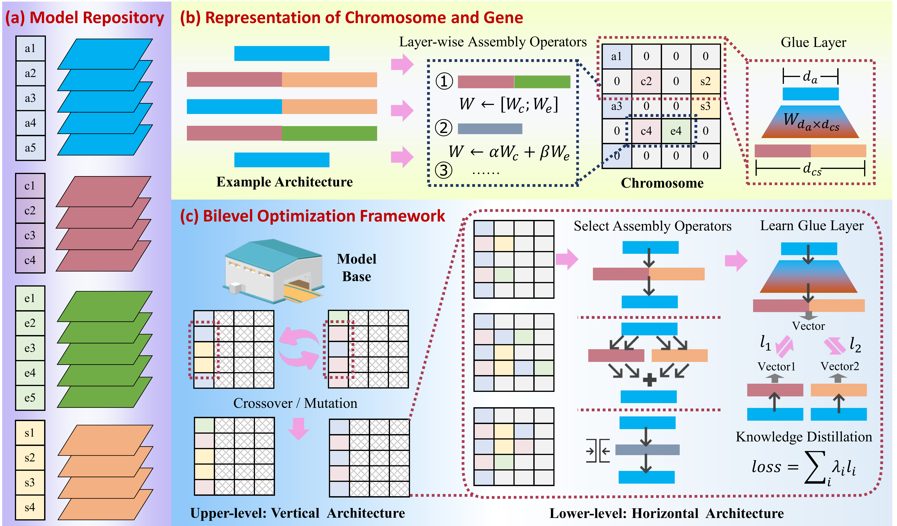

# LEGO-LLM
We propose architecture-level reassembly as a new paradigm for LLM reuse, which composes Transformer blocks into novel architectures via evolutionary search, enabling flexible depth scaling and cross-model capability integration without retraining.


# LEGO-LLM: Two-dimensional Architecture Reassembly of Large Language Models

<p align="center">
  
</p>

<p align="center"><em>Fig.1 Framework overview of LEGO-LLM.</em></p>

This repository contains the code for the paper **“Building LLMs Like LEGO: Two-dimensional Architecture Reassembly of Large Language Models”**. The project studies **architecture-level reuse** of pretrained large language models. Instead of treating each LLM as a monolithic object, the framework reuses Transformer blocks from multiple source models as modular building components, performs **vertical recombination across depth** and **horizontal composition within layers**, and uses **lightweight glue layers** trained by **data-free knowledge distillation** to make heterogeneous blocks work together.

---

## Overview

Most existing model reuse methods operate at the whole-model or parameter level: fine-tuning, parameter-efficient tuning, ensembling, or parameter merging. In contrast, this repository implements **architecture reassembly**:

- **Vertical reassembly**: select and reorder blocks from different source models across depth.
- **Horizontal reassembly**: allow multiple source blocks to jointly contribute to the same reassembled layer.
- **Glue layer alignment**: insert lightweight trainable interfaces between heterogeneous blocks to resolve hidden-state incompatibility.
- **Evolutionary search**: optimize the architecture using multi-objective evolutionary algorithms.

In the codebase, this idea is realized as a chromosome-based search space over:

1. selected source layers,
2. layer-wise assembly operators,
3. glue-layer alignment strength (`beta`), and
4. task-level performance / fairness objectives.

---

## Installation

### Environment

The original codebase targets:

- Python **3.10.x**
- PyTorch **2.1.2**
- Transformers **>= 4.38.0**
- `pymoo==0.6.1.3`
- `lm_eval==0.4.5`

### Install dependencies

```bash
pip install -r requirement.txt
```

If you prefer to create a clean environment first:

```bash
conda create -n lego_llm python=3.10 -y
conda activate lego_llm
pip install -r requirement.txt
```

---

## Preparing source models

The architecture search requires a **repository of source LLMs**. In the paper, the reassembly framework is built on a set of **language-specific LLaMA-family models**, including multilingual, Turkish, Chinese, English, Arabic, French, and Spanish variants. In particular, the paper states that the Spanish model is obtained by **LoRA fine-tuning** on `josecannete/large_spanish_corpus`.

Example source models mentioned in the paper include:

- multilingual: `lightblue/suzume-llama-3-8B-multilingual`
- Turkish: `ytu-ce-cosmos/Turkish-Llama-8b-Instruct-v0.1`
- Chinese: `Rookie/Llama-3-8B-Instruct-Chinese`
- English: `meta-llama/Meta-Llama-3-8B-Instruct`
- Arabic: `MohamedRashad/Arabic-Orpo-Llama-3-8B-Instruct`
- French: `Enno-Ai/EnnoAi-Pro-French-Llama-3-8B-v0.4`
- Spanish: a LoRA-fine-tuned model built from `meta-llama/Meta-Llama-3-8B-Instruct` on `josecannete/large_spanish_corpus`

In the current implementation, source models can be provided in three ways:

1. **Command-line argument**: `--model_paths`
2. **Environment variable**: `MOEA_MODEL_PATHS`
3. **Fallback defaults** defined in the code (for example, multilingual / Turkish / Chinese models are used as built-in defaults if no custom paths are provided)

### Option A: specify source models from the command line

```bash
python source_code/moea_llm_merge_run.py \
  --model_paths \
  lightblue/suzume-llama-3-8B-multilingual \
  ytu-ce-cosmos/Turkish-Llama-8b-Instruct-v0.1 \
  Rookie/Llama-3-8B-Instruct-Chinese
```

### Option B: specify source models through an environment variable

```bash
export MOEA_MODEL_PATHS="lightblue/suzume-llama-3-8B-multilingual,ytu-ce-cosmos/Turkish-Llama-8b-Instruct-v0.1,Rookie/Llama-3-8B-Instruct-Chinese"
python source_code/moea_llm_merge_run.py
```

### Option C: use your own fine-tuned language models

You are **not limited to the models listed in the paper**. You can also prepare your own language-specific models and use them as source blocks for architecture reassembly, as long as they can be loaded by `transformers.AutoModelForCausalLM.from_pretrained(...)`. This makes it possible to:

- replace any paper model with your own domain-adapted version,
- add more languages,
- use instruction-tuned or task-specific variants,
- mix pretrained and fine-tuned models in the same repository.

For example, you may first fine-tune a base LLaMA-family model for a target language, then pass the resulting checkpoint directory to `--model_paths`:

```bash
python source_code/moea_llm_merge_run.py \
  --model_paths \
  /path/to/my_english_model \
  /path/to/my_arabic_model \
  /path/to/my_spanish_lora_merged_model
```

### LoRA example in this repository

This project also includes a **LoRA fine-tuning example** for building a Spanish model, which is consistent with the paper’s experimental setup. The corresponding script is:

```text
source_code/lora_spanish_llm.py
```

You can use this script as a reference to build your own language-specific LoRA models before running architecture reassembly. A typical workflow is:

1. choose a base LLaMA-family model,
2. fine-tune it on a target-language corpus with LoRA,
3. optionally merge the LoRA adapter into the base model,
4. use the resulting model as one entry in `--model_paths`.

---

## Quick start

### Test run

The repository currently uses small default search budgets so that the code can be tested quickly.

```bash
python source_code/moea_llm_merge_run.py \
  --tasks xnli \
  --metric acc,none \
  --population_size 10 \
  --generations 50 \
  --inner_population_size 10 \
  --inner_generations 10 \
  --limit 0.2 \
  --batch_size 4 \
  --enable_distillation true \
  --save_path ./outputs/demo_run
```

---

## How to use the hierarchical search version

This section describes the recommended workflow in detail.

### Step 1. Choose the source model pool

Decide which source models will serve as reusable building blocks. The paper evaluates multilingual reassembly from language-specific LLaMA-family models.

Make sure each selected model:

- can be loaded by `transformers.AutoModelForCausalLM.from_pretrained`,
- has a compatible decoder-layer structure accessible via `model.model.layers`,
- has enough GPU memory available for repeated loading and evaluation.

### Step 2. Choose the evaluation task(s)

The code evaluates candidate architectures using `lm_eval`. Tasks are specified through:

```bash
--tasks
```

Examples:

```bash
--tasks xnli
--tasks mela
--tasks xnli,mela
```

The metric is specified through:

```bash
--metric
```

Examples:

```bash
--metric acc,none
```

Make sure the metric matches the selected task.

### Step 3. Configure the search budget

The main architectural search knobs are:

- `--new_model_layers`: depth of the reassembled model
- `--population_size`: outer population size
- `--generations`: outer generations
- `--inner_population_size`: inner population size
- `--inner_generations`: inner generations

### Step 4. Configure glue-layer distillation

Glue-layer training is controlled by:

- `--enable_distillation`
- `--seq_len`
- `--total_samples`
- `--distillation_batch_size`
- `--distillation_epochs`
- `--distillation_lr`
- `--distillation_alpha_context`
- `--beta_candidates`

If you want to disable glue-layer training for debugging:

```bash
--enable_distillation false
```

This can be useful for pipeline debugging, but it is **not** the intended research setting.

### Step 5. Launch the search

```bash
python source_code/moea_llm_merge_run.py \
  --model_paths MODEL_A MODEL_B MODEL_C \
  --tasks xnli \
  --metric acc,none \
  --save_path ./outputs/my_run
```

### Step 6. Inspect the outputs

After the run finishes, the code writes results to `--save_path`.

Expected outputs include:

- `reassembled_model_state.pt`: saved weights of the reassembled model
- tokenizer files: saved tokenizer assets
- `chromosome.json`: serialized architecture description
- `progress_log.csv`: real-time log of outer/inner search and distillation events

---

## Layer-wise operators used in the code

The repository defines the following operator set:

- `SUBSTITUTE` (`sub`): single-source block substitution
- `MERGE` (`merge`): weighted integration of branch outputs
- `CONCAT` (`concat`): feature concatenation followed by a projection layer
- `ENSEMBLE` (`ens`): output averaging across branches

These operators are selected per layer during search.

## Running the single-level version

The repository also includes a single-level variant:

```bash
python source_code/moea_llm_merge_single_level_multi_objective.py \
  --model_paths MODEL_A MODEL_B MODEL_C \
  --tasks xnli \
  --metric acc,none \
  --population_size 30 \
  --generations 50 \
  --save_path ./outputs/single_level_run
```

This version searches the full chromosome directly instead of using nested outer/inner optimization.

Use this version if you want:

- a simpler search structure,
- a more compact debugging path,
- direct full-chromosome multi-objective optimization.

Use the hierarchical version if you want the implementation that is most aligned with the paper’s bilevel design.

## Evaluation scripts

The repository contains separate benchmark scripts under `eval_data/`.

### 1) MELA

```bash
python "eval_data/Mela/eval_mela.py"
```

Before running, edit the script and set:

- `Model`
- `model_path`

The script evaluates the selected model with `lm_eval` on the `mela` task and stores the result as JSON.

### 2) XNLI

```bash
python "eval_data/Xnli/eval_xnli.py"
```

Again, edit the script first to set your model path if needed.

### 3) SeaEval and cross-lingual/cultural evaluation

The `SeaEval/` folder contains many shell scripts and helper modules. Typical usage follows the shell scripts in:

```text
eval_data/SeaEval/
```

Examples include:

```bash
bash "eval_data/SeaEval/Eval_lingual_llama_8B_Instruct.sh"
```

In addition, before running SeaEval, you need to manually modify:

```
eval_data/SeaEval/src/evaluate.py
```

Specifically, please update:

- dataset download / loading path
- result saving path

If these paths are not changed correctly, SeaEval may fail because it cannot find the dataset files or cannot save the evaluation results properly.

## Citation

If you use this repository, please cite the corresponding paper:

```bibtex
@inproceedings{wu2026lego_llm,
  title={Building LLMs Like LEGO: Two-dimensional Architecture Reassembly of Large Language Models},
  author={Wu, Xingyu and Zhou, Yu and Tan, Kay Chen},
  booktitle={Proceedings of the 64th Annual Meeting of the Association for Computational Linguistics},
  year={2026}
}
```

If you have any question about LEGO-LLM, please connect at zy-yu.zhou@connect.polyu.hk.
